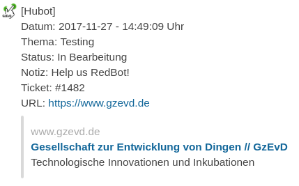
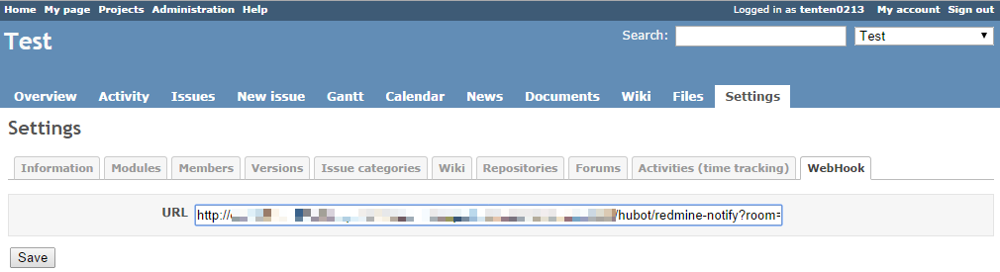

# redbot-redmine-notifier

Notifies about Redmine creating and updating tickets.
This Module is a fork of the [hubot-redmine-notifier](https://www.npmjs.com/package/hubot-redmine-notifier)
This fork will only notifie about the Notes inside a Redmine Ticket when called with a BuzzWord.
Example note of a redmine issue: "Some Foo @RedBot The message to send RedBot@ End Foo

## Getting Started

### Hubot
1. Install the module: cd into your HuBot folder `npm install redbot-redmine-notifier --save`
2. Add it `redbot-redmine-notifier` to your external-scripts.json file in your hubot directory

### Redmine
1. Install [Redmine Webhook Plugin](https://github.com/suer/redmine_webhook) to your Redmine.
2. Add hubot's endpoint to Redmine Project - Settings - WebHook - URL `http://<hubot-host>:<hubot-port>/hubot/redmine-notify?room=<room>` (see Screenshot)

## TODO
1. Make the BuzzWord variable
2. ?

## License
Licensed under the MIT license.

This script created with reference to the [halkeye/hubot-jenkins-notifier](https://github.com/halkeye/hubot-jenkins-notifier).
